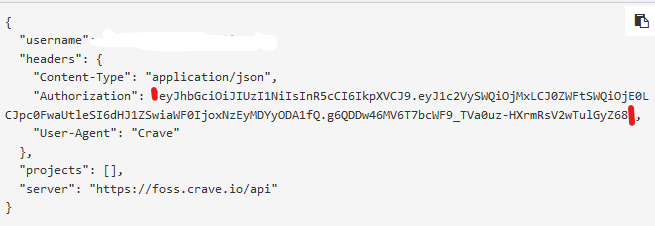
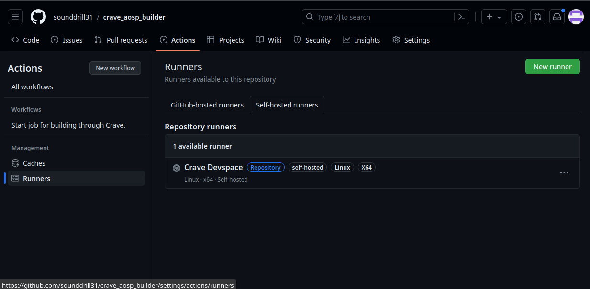
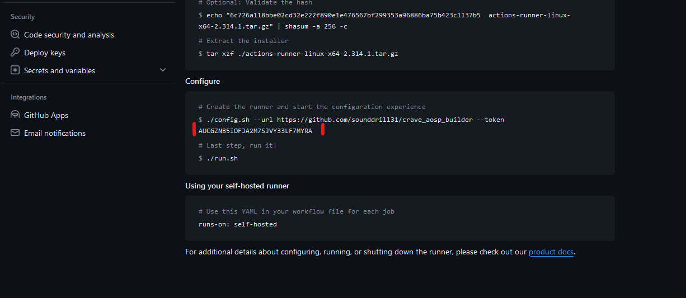
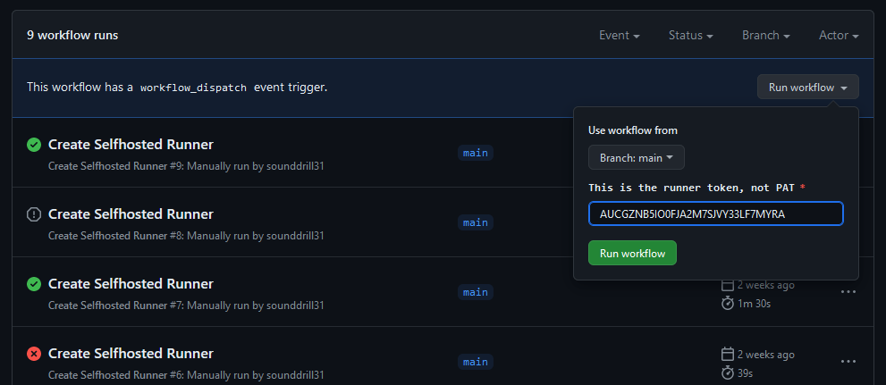

# crave_aosp_builder

[![Forks][forks-shield]][forks-url]
[![Stargazers][stars-shield]][stars-url]

<!-- MARKDOWN LINKS & IMAGES -->
<!-- https://www.markdownguide.org/basic-syntax/#reference-style-links -->
[forks-shield]: https://img.shields.io/github/forks/sounddrill31/crave_aosp_builder?style=for-the-badge
[forks-url]: https://github.com/sounddrill31/crave_aosp_builder/network/members
[stars-shield]: https://img.shields.io/github/stars/sounddrill31/crave_aosp_builder.svg?style=for-the-badge
[stars-url]: https://github.com/sounddrill31/crave_aosp_builder/stargazers

## Wiki
While using this repo, please take a look at [the wiki](https://opendroid.pugzarecute.com/wiki) as well!

## Prerequisites 
foss.crave.io account

## Setup Instructions
- Download crave.conf from API Keys of foss.crave.io dashboard
- Fork this repo
- Go to (repo) Settings -> Security -> Secrets and Variables -> Actions
- Copy your username and authentication token from crave.conf


- Create a Repository Secret called CRAVE_USERNAME, with username from crave.conf
- Create a Repository Secret called CRAVE_TOKEN, with authentication token from crave.conf


- Go to Settings -> Code and Automation -> Actions -> General
- Set workflow Permissions to "Read and Write Permissions" and save.

If this is greyed out and you're building from a Github Organization, 

go to Organization settings -> Code, planning, and automation -> Actions -> General -> Workflow permissions, set it to "Read and Write Permissions" and save

- Now you are ready to build! Go to "Crave Builder" workflow and start building
## Selfhosted Runners:
These runners sit in crave devspace CLI or your personal server and run the workflow on there. Use this if you need to bypass the 6 hours timeout limit.

## Extra Setup For Selfhosted runner:
- Follow the above steps
- On the top menu bar of the repository, click on Actions
- Self-Hosted Runner -> New Runner

- Scroll down and copy the Runner Token(avoid closing this tab till the process is done)


- Go back to Actions, select "Create Selfhosted Runner"
- Run Workflow and enter your Runner token.
Ensure you have no random spaces before or after


- Start the workflow
- After this is done, you are ready to build! Go to the "Crave Builder(self-hosted)" workflow and start building

(If the runner is offline still, trigger "Start/Restart Selfhosted Runner" workflow to force-restart the selfhosted runner)

## Required Secrets
### CRAVE_USERNAME (Required)
This is the email you signed up to crave with 

example: 
```
person@example.com
```
### CRAVE_TOKEN (Required)
This is the Authorization part of the crave.conf. It should not contain `:`, spaces, or `,`


### CUSTOM_YAML (Optional)
If this exists, the crave.yaml will be overridden while running the workflow

example:
```
CipherOS:
  ignoreClientHostname: true
Arrow OS:
  ignoreClientHostname: true
DerpFest-aosp:
  ignoreClientHostname: true
LOS 20:
  ignoreClientHostname: true
LOS 21:
  ignoreClientHostname: true
```

For more info, read the documentation [here](https://foss.crave.io/docs/crave-usage/#location-of-the-craveyaml-file)
### EXTRA_FILES (Optional)
If this exists, these files will be uploaded too. Remember to use relative path like out/target/product/devicename/file.something and seperate multiple files with spaces.
### TELEGRAM_TOKEN (Optional)
Bot token for telegram notifications
### TELEGRAM_TO (Optional)
Chat id for telegram notifications
### CRAVE_FLAGS (Optional)
Extra flags for crave binary
### TG_UPLOAD_LIMIT (Optional)
Custom Upload limit for telegram-upload. Default is 2147483648
### GH_UPLOAD_LIMIT (Optional)
Custom Upload limit for github releases. Default is 2147483648

## Inputs Explanation
### Base Project
    - These are the projects everyone can build, with a foss.crave.io account
    - These are the ones officially added
### Repo init Command
    - This is only for when you are initializing another ROM. When doing this, ensure you are initializing on top of closest cousin base project
    - Don't initialize android 14 on top of android 13 projects
    - If you just type 'skip', it will skip the compilation. This is useful for uploading and debugging
### Removals
    - When we resync another ROM on top, we are bound to get "cannot checkout" errors. To fix this, we add that folder to the Removals tab
    - Add a space after .repo/local_manifests and add these folders. Don't change if you don't need to
    - Almost defunct now, since /opt/crave/resync.sh script on crave handles everything for us
### Local Manifest
    - Here you enter the git repo and branch for your local manifests, containing device specific repositories. These will be cloned to .repo/local_manifests
### Device Details
    - Enter the device codename you want to build for inside DEVICE_NAME, like "oxygen".
    - Enter the device codename inside PRODUCT_NAME, to be inserted into the breakfast command. If you enter makefile name(without the .mk, like "lineage_oxygen"), it will fallback to using the lunch command. 
### Build Command
    - eg. m updatepackage, mka bacon, make recoveryimage
### Build Type
    - Choose the build type
- user:  Limited access; suited for production

- userdebug:  Like user but with root access and debug capability; very close to production performance

- eng:  Development configuration with faster build time; most suited for day-to-day development
### Clean Build
  - Uses fresh Base Project sources without any of your changes(use only for testing/debugging)

## Known Issues
  - You Tell Me :)
## Extra Info
  - For scheduled builds, it's better to remove the workflow dispatch stuff, check [lineage_builder](https://github.com/a57y17lte-dev/lineage_builder) for reference.
  - This Repo is a spiritual successor to azwhikaru's Action-TWRP-Builder
## Credits!
  - [AntoninoScordino](https://github.com/AntoninoScordino) for the recent rewrite
  - [azwhikaru's Action-TWRP-Builder](https://github.com/azwhikaru/Action-TWRP-Builder) Which I used as reference
  - [My Manifest tester](https://github.com/sounddrill31/Manifest_Tester) (credits to [AmogOS](https://github.com/AmogOS-Rom) project for original logic)
  - [Other contributors](https://github.com/sounddrill31/crave_aosp_builder/graphs/contributors)
  - [The crave team](https://github.com/accupara) for the build servers and helping us out when we get stuck

## FAQs:

### Signup

Q1. What is this Crave.io? How do I get an account?

A. Crave.io is a build accelerator capable of cutting down build time by quite a bit. They are providing free build servers, however: self signup is disabled. 

Please contact either `uvatbc`(`yuvraaj` on telegram) or me on discord/telegram.

Remember to share the following:
- Name
- Email
- Git profile(preferably with your device sources or stuff you're proud of)    


### Chat Help
Q2. Hey, I get an error with this repository! Whom do i ask?

A. Please feel free to contact me through the [crave.io discord](https://discord.crave.io) or [ROM Builders telegram](https://t.me/ROM_builders). My username is `sounddrill`


### Unsupported ROMs
Q3. This doesn't support XXnewrom2024XX! How do I build it?

A. [Read this](#repo-init-command)

Here, we enter our repo init command for a non-supported ROM. If we are building something that's supported by crave, we can leave the default as is. 

Doing this is not recommended and is known to be troublesome. However, it doesn't break any crave rules yet. 

### Build Signing
Q4. How do I sign my builds?

A. Build signing can be done using Backblaze B2 Buckets to hold the private keys. 

Follow [this](https://opendroid.pugzarecute.com/wiki/Crave_Signing) guide to generate, encrypt and upload your keys to Backblaze.

Create a actions secret called CUSTOM_YAML with the correct credentials as your environment variables. If this secret is set, the workflow will use this for crave.yaml, instead of the templates found in config/crave folder of this repository. 

```
LOS 21:
  ignoreClientHostname: true
  env:
    BUCKET_NAME: your_bucket_name
    KEY_ENCRYPTION_PASSWORD: your_key_encryption_password
    BKEY_ID: your_bkey_id
    BAPP_KEY: your_bapp_key
```

Replace "LOS 21" with your base project's name. Remember to use the correct name, get it from `crave clone list`.

Also remember to replace the placeholder credentials with actual values.

It is also recommended to set ignoreClientHostname to preserve workflow persistence. Read more about it [here](https://opendroid.pugzarecute.com/wiki/Crave_Devspace#workspace-persistence).

Steps:
- Go to (repo) Settings -> Security -> Secrets and Variables -> Actions
- Set repository secret called CUSTOM_YAML
- Enter the contents of your crave.yaml from above

While building: 
- Replace 'mka bacon' in the build command section of the workflow dispatch to:

```
mka target-files-package otatools; /opt/crave/crave_sign.sh
```
